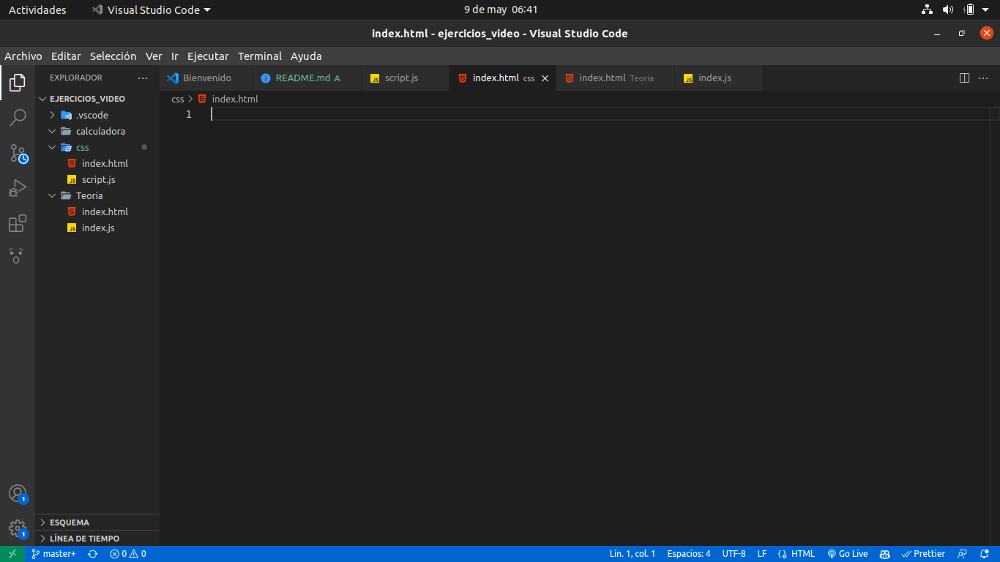
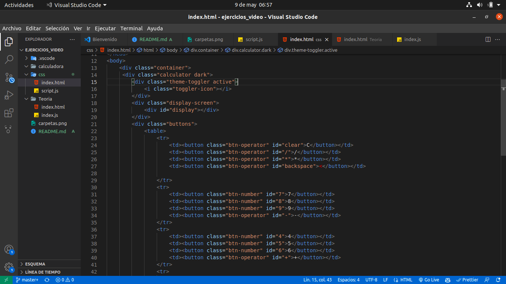
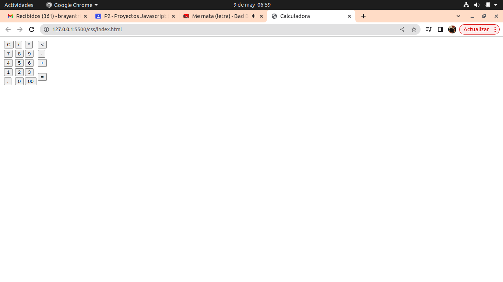
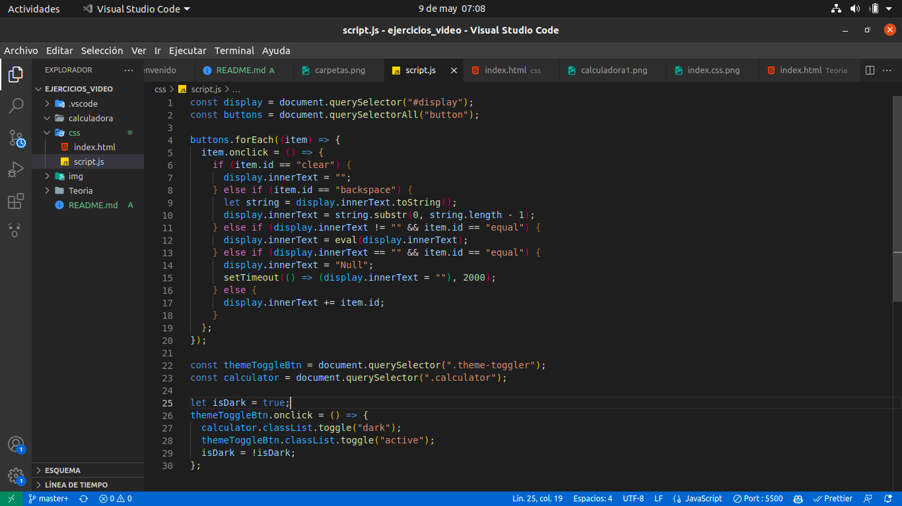
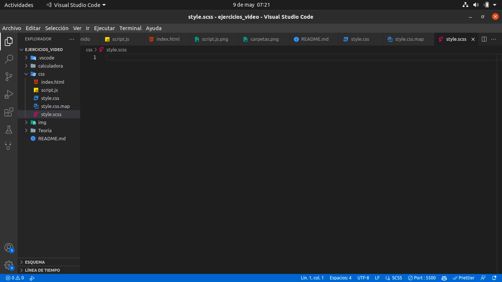
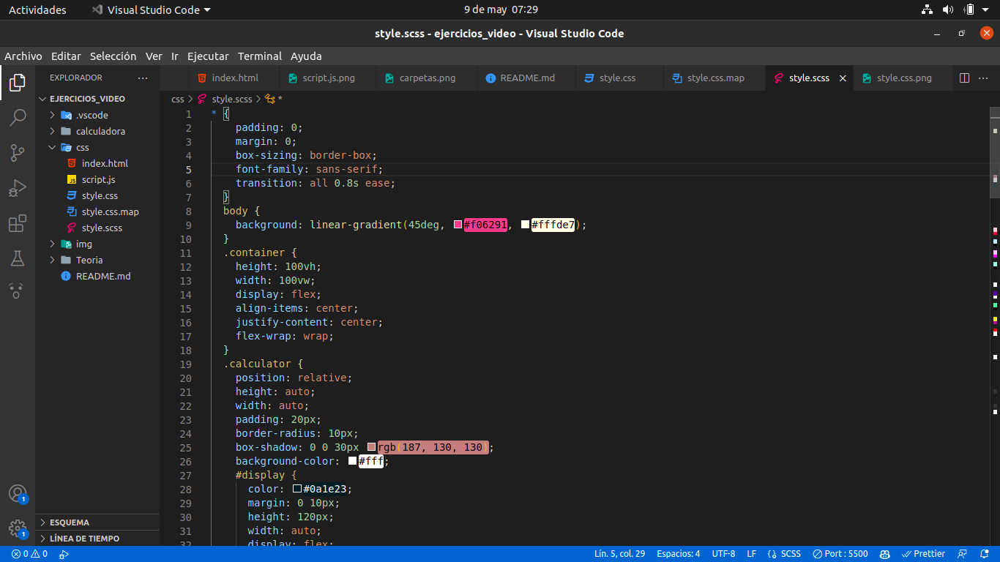
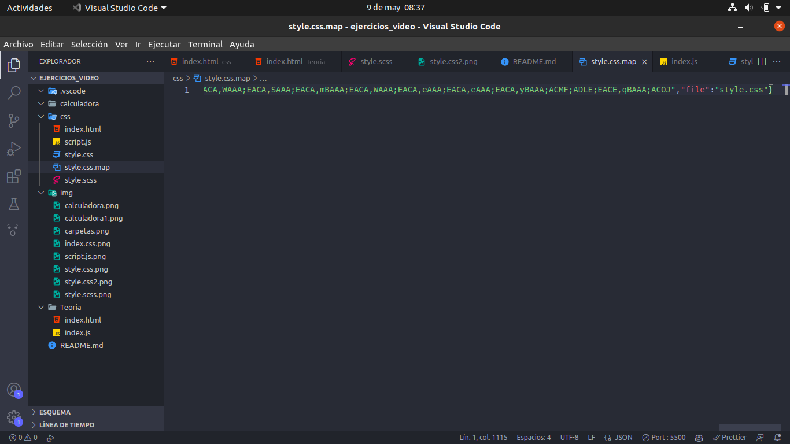
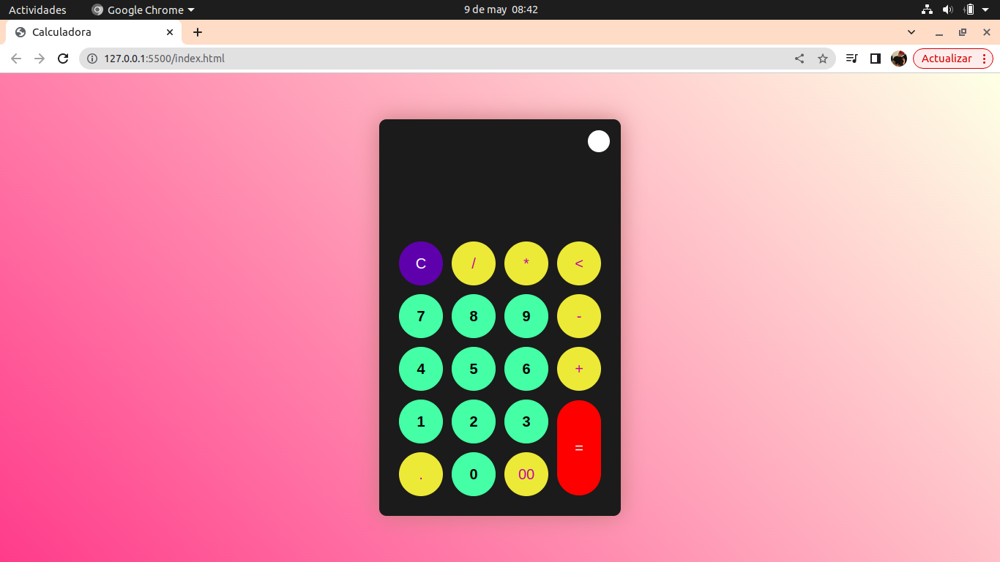
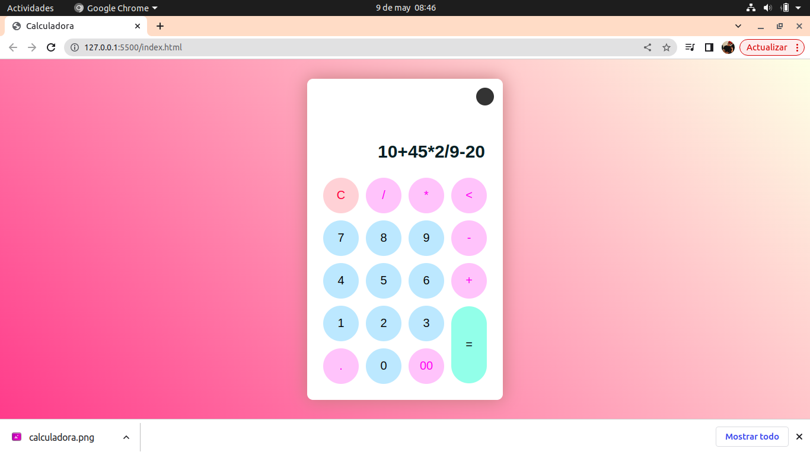

# EJERCICIO CALCULADORA

## 1. Creamos todas las carpetas y documentos.

## 2. Hacemos el codigo index de la carpeta css.

## 3. Hacemos el codigo script.js de la carpeta css.

## 4. Creamos los archivos style.css, style.css.map y style.scss en la carpeta css.

## 5. Hacemos el codigo style.scss en la carpeta css.

## 6. Hacemos el codigo style.css en la carpeta css.

## 7. Hacemos el codigo style.css.map en la carpeta css.

## 8. Aca ya queda terminada la calculadora.

