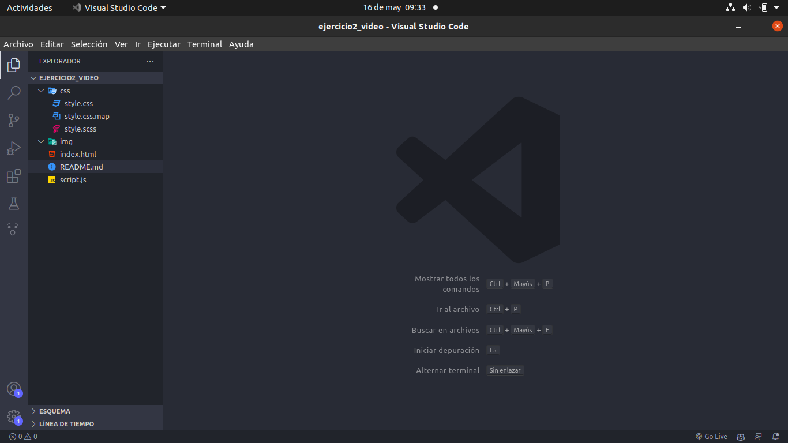
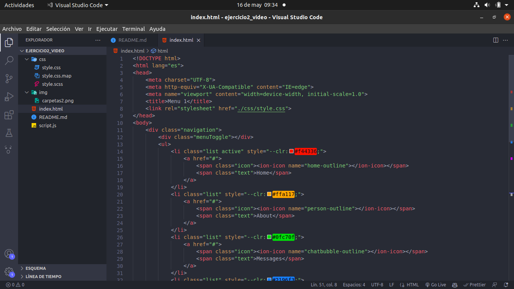
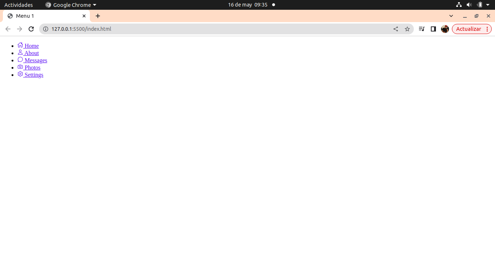
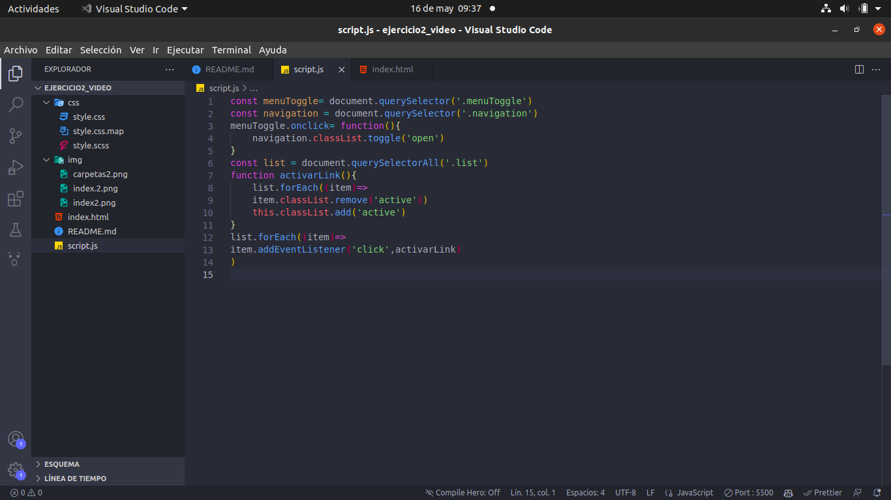
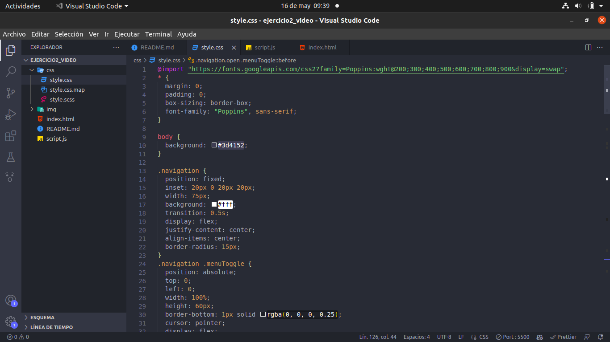
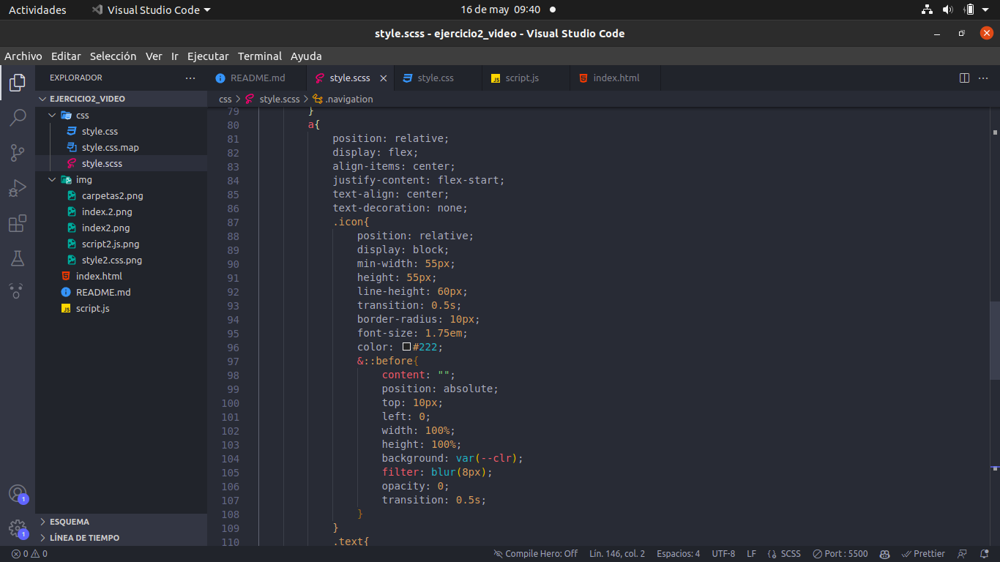
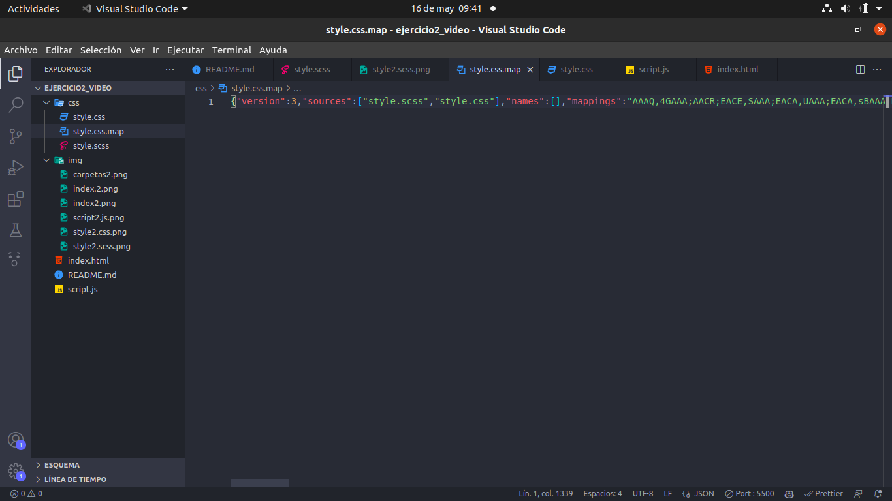
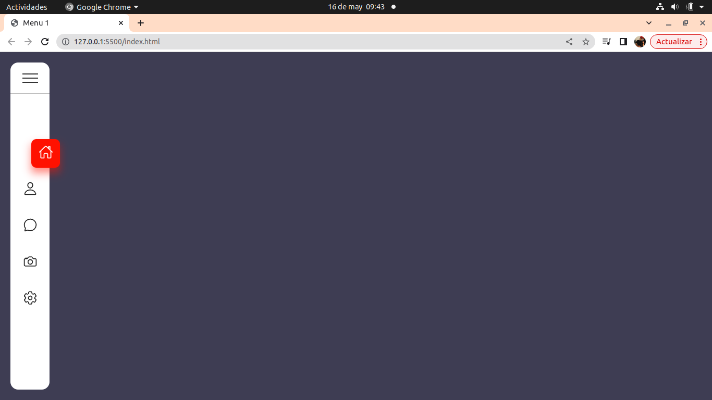
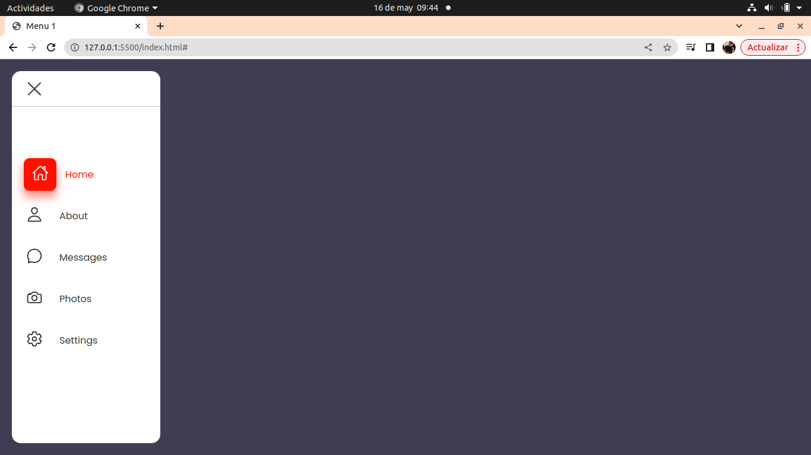

# EJERCICIO MENU

## 1. Creamos todas las carpetas y documentos.

## 2. Hacemos el codigo index.

## 3. Hacemos el codigo script.js.

## 4. Hacemos el codigo style.css.

## 5. Hacemos el codigo style.scss.

## 6. Hacemos el codigo style.css.map.

## 7. Aca ya queda terminado el menu.

